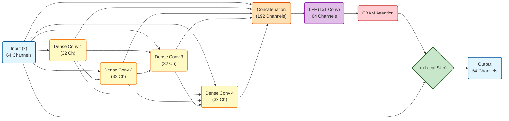

# Proposed Method: Frequency-Aware Residual Dense Network (FreqRDN)

이 문서는 FreqRDN 모델의 아키텍처를 논문이나 기술 문서에 바로 삽입할 수 있도록 학술적인 어조와 논리적인 흐름으로 정리한 초안입니다.

---

## 1. Introduction to the Architecture

초해상도(Super-Resolution, SR) 작업에 있어 공간 해상도(Spatial Resolution)의 보존은 고주파 엣지와 미세한 디테일 복원에 필수적입니다. 본 연구에서 제안하는 **FreqRDN (Frequency-Aware Residual Dense Network)**은 주파수 도메인(Frequency Domain)에서 작동하는 혁신적인 신경망 아키텍처로, 다운샘플링(Downsampling) 과정을 완전히 배제하여 원본의 공간 정보를 100% 보존합니다. 

본 모델은 2D 이산 웨이블릿 변환(2D Discrete Wavelet Transform, DWT)을 통해 저해상도 이미지에서 추출된 4가지 주파수 하위 대역(LL, LH, HL, HH)을 입력으로 받으며, 최종적으로 고해상도 이미지 복원에 필요한 3가지 고주파 대역(LH, HL, HH)의 잔차(Residual)를 정교하게 예측하도록 설계되었습니다. 전체 네트워크는 특징 추출부(Head), 깊은 특징 매핑부(Body), 그리고 주파수 특화 재구성부(Tail)의 세 단계로 구성되며, 밀집 연결(Dense Connection)과 주파수 인식 분기(Frequency-Aware Branches) 구조를 도입하여 복원 성능을 극대화하였습니다.

## 2. Network Architecture

제안하는 FreqRDN 네트워크의 구체적인 작동 방식은 다음과 같습니다.

### 2.1. Initial Feature Extraction (Head)
네트워크의 입력단(Head)은 4채널의 저해상도 웨이블릿 계수($x \in \mathbb{R}^{4 \times H \times W}$)를 받아들입니다. 이때 4개의 주파수 하위 대역(LL, LH, HL, HH)은 채널 축(Channel Dimension)을 기준으로 결합(Concatenation)되어 하나의 텐서로 입력됩니다. 이곳에서 $3 \times 3$ 컨볼루션(Convolution) 연산을 수행하여 4개의 채널을 64채널의 얕은 특징 맵(Shallow Feature Map)으로 추출 및 매핑합니다. 이 초기 특징 맵은 4가지 대역의 상호 연관성을 포착하여 이어지는 깊은 네트워크의 기본 정보로 활용될 뿐만 아니라, 후반부의 전역 잔차 연결(Global Residual Connection)을 통해 최종 출력 부근으로 전달되어 저주파 골격 정보를 보존하는 역할을 합니다.

### 2.2. Deep Feature Mapping (Body with RDB & CBAM)
초기 특징 맵은 네트워크의 핵심인 **잔차 밀집 블록(Residual Dense Blocks, RDB)**으로 구성된 Body 모듈을 통과합니다. 
*   **Dense Connections (밀집 연결):** 단일 RDB 내부에는 4개의 밀집 계층(Dense Layer)이 직렬로 배치되어 있습니다. 일반적인 CNN이 이전 층의 출력만을 다음 층의 입력으로 사용하는 것과 달리, 밀집 계층에서는 이전 모든 계층의 출력 특징 맵을 채널 축으로 결합(Concatenation)하여 다음 계층의 입력으로 제공합니다. 예를 들어 4번째 계층은 1, 2, 3번째 계층이 추출한 특징뿐만 아니라 블록의 최초 입력 특징까지 모두 동시에 관찰할 수 있습니다. 이를 통해 네트워크는 저수준(Low-level)부터 고수준(High-level)까지의 미세한 주파수 특징을 단 하나도 유실하지 않고 보존하며, 극도로 풍부하고 연속적인 특징(Abundant Features)을 학습할 수 있습니다.
*   **Local Feature Fusion (LFF, 국소 특징 융합):** 밀집 연결을 거치면 채널의 수(Growth Rate 누적)가 폭발적으로 증가합니다(예: 64채널 $\rightarrow$ 192채널). LFF는 블록의 마지막에 위치한 $1 \times 1$ 컨볼루션 계층으로, 이렇게 비대해진 다중 수준(Multi-level)의 밀집 특징들을 다시 원래의 기저 채널 수(64채널)로 압축 및 융합합니다. 이는 단순한 차원 축소가 아니라, 채널 간의 선형 결합을 통해 가장 핵심적이고 유효한 고주파 특징만을 선별(Feature Selection)하는 병목(Bottleneck) 역할을 수행합니다.
*   **CBAM (Convolutional Block Attention Module):** LFF 이후에는 CBAM이 적용됩니다. 채널 주의력(SENet 등) 단일 메커니즘만을 사용하거나 연산량이 막대한 일반적인 어텐션과 달리, CBAM은 **채널(Channel) 주의력**과 **공간(Spatial) 주의력**을 순차적으로 결합한 경량화된 모듈입니다. 채널 주의력은 Max-Pooling과 Avg-Pooling을 동시에 사용하여 '어떤(What)' 주파수 맵이 중요한지를 파악하고, 공간 주의력은 큰 수용 영역($7 \times 7$ Conv)을 통해 이미지 상의 '어디(Where)'에 엣지가 위치하는지를 정확히 짚어냅니다. 초해상도(SR) 관점에서 CBAM은 평탄한 영역(Flat regions)에서 발생하는 잡음(Artifacts)을 강하게 억제하고, 날카로운 윤곽선과 질감 성분만을 선택적으로 증폭시키는 아주 강력한 필터 역할을 합니다.

### 2.3. Frequency-Aware Reconstruction (Tail)
여러 개의 RDB를 통과한 깊은 특징 맵은 전역 특징 융합(Global Feature Fusion, GFF) 계층을 거친 후, Head에서 추출되었던 얕은 특징 맵과 더해집니다.
본 아키텍처의 가장 독창적인 부분은 네트워크 출력단(Tail)에 설계된 **주파수 인식 분기(Frequency-Aware Branches)**입니다. 
*   **Independent Branches:** 가로(LH), 세로(HL), 대각선(HH) 방향의 고주파 성분은 각기 다른 공간적 특성과 분포를 가집니다. 이를 단일 컨볼루션 레이어로 예측하는 기존 방식의 한계를 극복하기 위해, FreqRDN은 깊은 특징 맵을 3개의 독립적인 Branch로 전달합니다. 각 Branch는 자신이 담당하는 특정 방향의 엣지 복원만을 전문적으로 학습(Specialization)하여, 더욱 정교하고 논리적인 주파수 대역 예측을 가능하게 합니다.
*   **Branch 내 Conv-ReLU-Conv 구조의 논리:** 각 Branch는 단순히 1차례의 선형 변환($3 \times 3$ Conv)으로 끝나는 것이 아니라, `Conv(64 -> 32) - ReLU - Conv(32 -> 1)`로 이어지는 얕은 다층 퍼셉트론(MLP)과 유사한 비선형 병목(Non-linear Bottleneck) 구조를 띕니다. 첫 번째 Conv는 고차원(64채널)의 공통 특징 공간에서 해당 방향(예: 가로 엣지)에만 유효한 32채널의 핵심 특징만을 추출하며 차원을 축소합니다. 이후 ReLU의 비선형성을 통해 불필요한 노이즈를 0으로 소거(Filtering)하고, 마지막 Conv를 통해 최종적인 1채널 잔차(Residual) 맵으로 투영(Projection)합니다. 이 구조는 각 Branch가 자신만의 독립적인 비선형 적응력(Adaptability)을 갖추게 하여 복원의 질을 높입니다.
*   **Global HF Skip Connection:** 3개 Branch의 출력을 결합한 후, 마지막으로 입력 신호 중 고주파 성분(LR의 LH, HL, HH)을 더해주는 전역 고주파 잔차 연결(Global High-Frequency Skip Connection)을 적용합니다. 이로 인해 네트워크는 고주파 대역 전체를 처음부터 생성하는 대신, 이상적인 고해상도 고주파 성분과 입력된 저해상도 고주파 성분 사이의 '차이(Missing Details)'만을 예측하는 희소 표현(Sparse Representation) 학습을 수행하게 되어 학습의 안정성과 수렴 속도가 대폭 향상됩니다.

### 2.4. Detailed Architecture of Residual Dense Block (RDB)

아래는 RDB 내부의 밀집 연결(Dense Connection), 국소 특징 융합(LFF), 그리고 CBAM이 어떻게 상호작용하는지 보여주는 상세 시각화입니다. (예시 채널 수: 기본 64, 성장률 32, 4개의 Dense Layer)



---

## 3. Justification of Architectural Choices (설계 논거)

본 연구에서 FreqRDN 구조를 채택한 논리적 근거는 다음과 같습니다.

1.  **공간 해상도 보존 (No Downsampling):** U-Net과 같은 기존 구조에서 흔히 사용되는 풀링(Pooling) 및 스트라이드 컨볼루션(Strided Convolution)은 공간 정보를 압축하여 고주파 엣지의 정확한 위치 정보를 훼손합니다. 본 모델은 입출력 해상도를 동일하게 유지하여 주파수 도메인에서의 픽셀 단위 엣지 정밀도를 보장합니다.
2.  **잔차 밀집 네트워크 (Residual Dense Blocks)의 도입:** 주파수 변환된 데이터는 일반 RGB 이미지에 비해 정보가 압축적이고 추상적입니다. 일반적인 잔차 블록(ResBlock)을 통과하며 잃어버릴 수 있는 미세한 고주파 특징들을, 내부 밀집 연결(Dense Connection)을 통해 하나도 빠짐없이 다음 레이어로 넘겨주어 고주파 디테일의 정보 손실(Information Loss)을 원천 차단합니다.
3.  **주파수 전담 분기 (Frequency-Aware Branches):** 대역별(Horizontal, Vertical, Diagonal)로 기하학적 특성이 명확히 구분되는 웨이블릿 고주파 계수의 본질에 착안하였습니다. 각 대역을 전담하는 독립된 네트워크 Branch를 구성함으로써, 억지스러운 특징 융합을 피하고 각 방향성 엣지에 대한 독립적인 전문성을 확보하였습니다.
4.  **저주파(LL) 대역 예측의 배제와 고주파 집중 학습:** 초해상도(SR) 문제의 핵심은 잃어버린 고주파 디테일을 복원하는 데 있습니다. 저주파 대역(LL)은 원본 이미지의 전반적인 구조와 색상 정보를 담고 있으며, 이는 이미 저해상도(LR) 입력에 충분히 보존되어 있습니다. 네트워크가 LL 대역까지 다시 예측하도록 강제하면 불필요하게 모델 파라미터가 낭비될 뿐만 아니라, 자칫 구조적 왜곡이나 색상 변형(Color Shift)을 유발할 수 있습니다. 따라서 FreqRDN은 LL 대역을 그대로 유지(Bypass)하고, 오직 복원이 필요한 3개의 고주파 대역(LH, HL, HH)의 잔차만을 예측하도록 설계하여 네트워크의 학습 능력을 미세한 엣지 복원에 100% 집중시켰습니다.

## 4. Mermaid 시각화 코드 (논문 피규어 작성용)

```mermaid
graph TD
    %% Input
    Input["Input LR Wavelets (LL, LH, HL, HH)<br/>[B, 4, H, W]"] --> Head

    %% Head
    subgraph Feature Extraction
        Head["Conv 3x3 (Head)<br/>Extract Shallow Features"]
    end

    %% Body (RDB)
    Head --> RDB1
    Head -- Global Feature Skip --> GlobalAdd1{"+"}
    
    subgraph Deep Feature Mapping (Body)
        RDB1["Residual Dense Block 1"] --> RDB2["Residual Dense Block 2...8"]
        RDB2 --> GFF["Global Feature Fusion (GFF)<br/>Conv 3x3"]
    end
    
    GFF --> GlobalAdd1
    
    %% Tail (Frequency Branches)
    subgraph Frequency-Aware Reconstruction (Tail)
        GlobalAdd1 --> BranchLH["Tail LH Branch<br/>(Conv-ReLU-Conv)"]
        GlobalAdd1 --> BranchHL["Tail HL Branch<br/>(Conv-ReLU-Conv)"]
        GlobalAdd1 --> BranchHH["Tail HH Branch<br/>(Conv-ReLU-Conv)"]
        
        BranchLH --> Concat["Concatenation<br/>[B, 3, H, W]"]
        BranchHL --> Concat
        BranchHH --> Concat
    end

    %% Global HF Skip Connection
    Input -- Extract LR HF (LH, HL, HH) --> HFSkip{"+"}
    Concat --> HFSkip

    %% Output
    HFSkip --> Output["Output Predicted HR HF<br/>(LH, HL, HH)"]
    
    %% RDB Zoom-in (Optional for detail)
    style RDB1 fill:#f9f,stroke:#333,stroke-width:2px
    style BranchLH fill:#bbf,stroke:#333,stroke-width:1px
    style BranchHL fill:#bbf,stroke:#333,stroke-width:1px
    style BranchHH fill:#bbf,stroke:#333,stroke-width:1px
```
